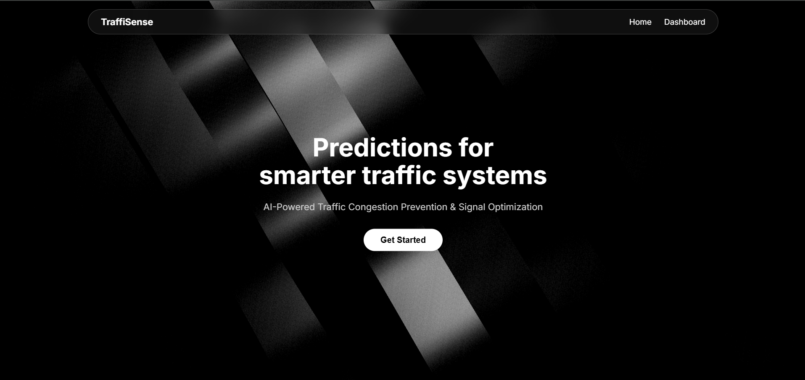
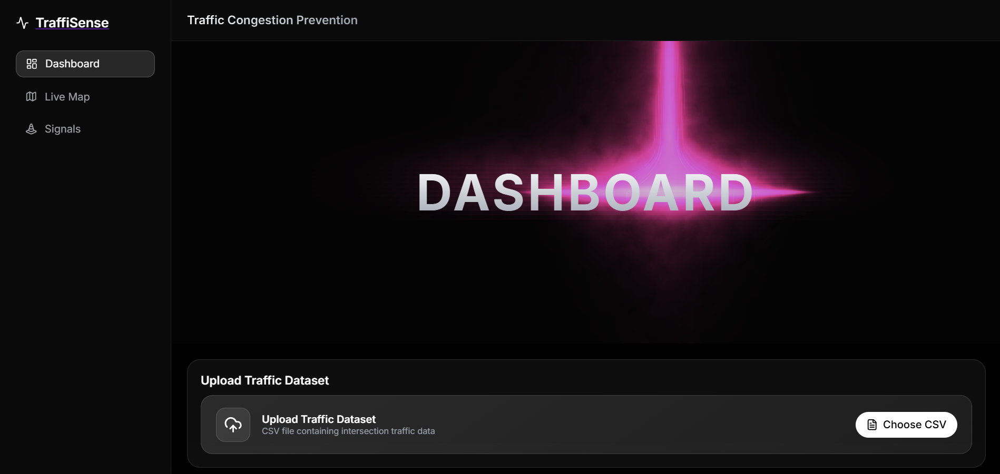
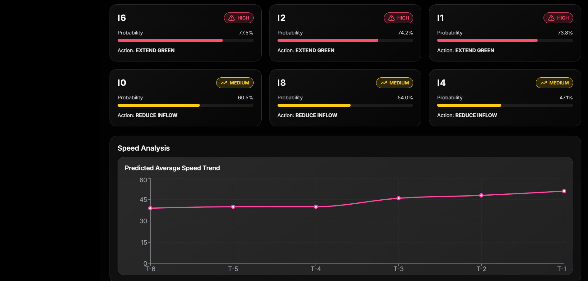
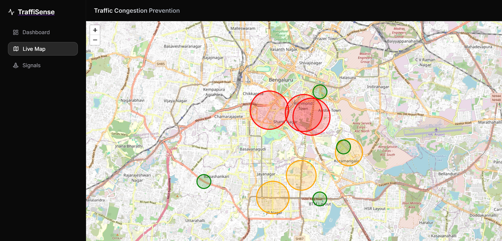
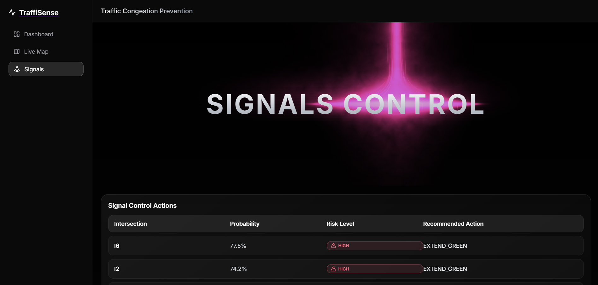

# TraffiSense

An **agentic, cloud–microservice–based traffic intelligence system** that predicts **near-future traffic congestion** using machine learning and **autonomously recommends preventive traffic control actions** (signal timing, inflow reduction) *before congestion occurs*.

This project implements the **“Proactive Traffic Congestion Prevention Pattern”**, combining:
- **Spatio-temporal traffic prediction (GRU-based ML model)**
- **Agentic decision logic (ATCA)**
- **Interactive traffic visualization dashboard**
- **Cloud deployment using free-tier infrastructure**

1. **Home Page**  


2. **Dashboard**  
 



3. **Live Map**  


4. **Signal Control**  

---

## Features

- **Machine Learning–based Congestion Prediction**
- **Autonomous Traffic Control Agent (ATCA)**
- **Interactive Traffic Congestion Map**
- **Analytics Dashboard (Charts & Risk Cards)**
- **Cloud-Native Microservice Architecture**
- **CSV-based Real-Time Prediction Upload**

---

## System Architecture Overview

```
User (Web Browser)
        ↓
React Frontend (Vercel)
        ↓ REST API
FastAPI ML Inference Service (Render)
        ↓
GRU-based Traffic Prediction Model
        ↓
Agentic Traffic Control Logic (ATCA)
        ↓
Traffic Control Recommendations + Visualization
```

---

## Model Used

### Traffic Congestion Prediction Model

- **Architecture:** GRU (Gated Recurrent Unit)
- **Task:** Predict congestion probability for each traffic sensor
- **Input:** Speed readings over **12 time steps (5-min intervals)**
- **Output:** Congestion probability (0–1) per sensor
- **Inference:** CPU-based (cloud-friendly)

---

## Datasets Used

### 🔹 Training Dataset
**METR-LA Traffic Dataset**
- Kaggle: https://www.kaggle.com/datasets/annnnguyen/metr-la-dataset
- 207 traffic sensors (Los Angeles)
- 5-minute interval speed data

---

### 🔹 Sensor Location Data

#### 1️. LA Sensor Locations (METR-LA)
- https://github.com/liyaguang/DCRNN/tree/master/data/sensor_graph

#### 2️. Bangalore Traffic Signal Locations
- Source: OpenStreetMap (Overpass Turbo)
- https://overpass-turbo.eu/

---

## Google Colab Training Notebook

Model training and experimentation:

https://colab.research.google.com/drive/1X33Ym9cUp81W6vL3rqHa9J4elEb-aiTG

Includes:
- Data preprocessing
- GRU model training
- Evaluation
- Model checkpoint saving

---

## Project Structure

```
traffic-system/
│
├── frontend/                  
│   ├── src/
│   │   ├── components/
│   │   ├── pages/
│   │   ├── context/
│   │   ├── api/
│   │   └── App.jsx
│
├── prediction_service/        
│   ├── app.py
│   ├── model.py
│   ├── traffic_gru_final.pt
│   └── requirements.txt
│
├── atca_service/              
├── coordination_service/      
├── logging_service/           
│
├── docker-compose.yml
└── README.md
```

---

## Running Locally

### Backend (FastAPI)

```bash
cd prediction_service
pip install -r requirements.txt
uvicorn app:app --reload
```

Runs at:
```
http://127.0.0.1:8000
```

---

### Frontend (React)

```bash
cd frontend
npm install
npm run dev
```

Runs at:
```
http://localhost:5173
```

---

## Hosting Details

### Frontend
- **Platform:** Vercel
- **URL:** https://traffic-congestion-prevention.vercel.app/

### Backend
- **Platform:** Render
- **URL:** https://traffic-congestion-prevention.onrender.com

> Cold-start latency is handled via frontend loading states.

---

## Academic Context

- **Technology Readiness Level (TRL):** 4  

- **Domain:** Intelligent Transportation Systems, Smart Cities, Cloud Computing

---

## Author

**Dhinesh Kumar S**  
VIT Vellore  
GitHub: https://github.com/Dhinn02

---

## Disclaimer

This project is developed **for educational and research purposes only**.  
It does not control real-world traffic infrastructure.
